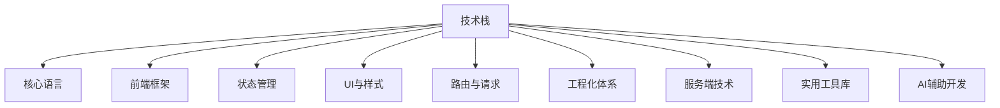

# 你好，我是 DREAM

I expect that the level of abstraction of our languages will continue to increase. I also expect that the number of domain-specific languages will continue to grow. This will be a good thing. ---《Clean Code》

> 我期望语言的抽象程度继续提升。我也期望领域特定语言的数量继续增加。那会是好事一桩。 ---《代码整洁之道》

## 🚀 关于我（前端）

But it will not eliminate code. Indeed, all the specifications written in these higher level and domain-specific language will be code! It will still need to be rigorous, accurate, and so formal and detailed that a machine can understand and execute it. ---《Clean Code》

> 但那终结不了代码。实际上，**在较高层次上用领域特定语言撰写的规约也将是代码**！它也得严谨、精确、规范和详细，好**让机器理解和执行**。 ---《代码整洁之道》

## 🛠️ 技术栈

### 🎯 核心语言

| 类别                         | 描述                 | 熟练度 |
| :--------------------------- | :------------------- | :----- |
| HTML5/CSS3/JavaScript (ES6+) |                      | ⭐⭐⭐⭐⭐  |
| TypeScript                   | 类型系统、接口、泛型 | ⭐⭐⭐⭐⭐  |

### ⚛️ 前端框架

| 类别                | 描述                            | 熟练度 |
| :------------------ | :------------------------------ | :----- |
| React 16/18 (Hooks) | 函数组件、自定义Hooks、并发模式 | ⭐⭐⭐⭐⭐  |
| Umi 4/Max           | 企业级前端框架、插件体系        | ⭐⭐⭐⭐   |
| Next.js             | SSR/SSG、App Router、服务端组件 | ⭐⭐⭐⭐   |
| Vue 3               | Composition API、响应式系统     | ⭐⭐⭐⭐⭐  |
| Angular 1.x         | 传统项目维护                    | ⭐⭐⭐⭐⭐  |

### 📦 状态管理

| 类别  | 描述                  | 熟练度 |
| :---- | :-------------------- | :----- |
| Redux | 单向数据流、中间件    | ⭐⭐⭐⭐⭐  |
| Dva   | 基于Redux的轻量级框架 | ⭐⭐⭐⭐   |
| MobX  | 响应式状态管理        | ⭐⭐⭐⭐⭐  |
| Pinia | Vue3官方推荐状态库    | ⭐⭐⭐⭐⭐  |

### 🎨 UI 与样式

**组件库**

| 类别               | 描述           | 熟练度 |
| :----------------- | :------------- | :----- |
| Ant Design 4/5/Pro | 企业级UI组件库 | ⭐⭐⭐⭐⭐  |
| Bootstrap 5        | 响应式CSS框架  | ⭐⭐⭐⭐⭐  |

**可视化**

| 类别       | 描述             | 熟练度 |
| :--------- | :--------------- | :----- |
| AntV/XFlow | 图可视化与流程图 | ⭐⭐⭐⭐⭐  |
| ECharts    | 数据图表库       | ⭐⭐⭐⭐   |
| ComfyUI    | AI工作流界面     | ⭐⭐⭐⭐⭐  |

**CSS**

| 类别           | 描述          | 熟练度 |
| :------------- | :------------ | :----- |
| Tailwind CSS   | 原子化CSS框架 | ⭐⭐⭐⭐⭐  |
| Sass/SCSS/Less | CSS预处理器   | ⭐⭐⭐⭐   |
| css-in-js      |               | ⭐⭐⭐⭐⭐  |

### 🔗 路由与请求

**路由管理**

| 类别         | 描述              | 熟练度 |
| :----------- | :---------------- | :----- |
| React Router | React路由解决方案 | ⭐⭐⭐⭐⭐  |
| Vue Router   | Vue路由解决方案   | ⭐⭐⭐⭐   |

**数据请求**

| 类别    | 描述               | 熟练度 |
| :------ | :----------------- | :----- |
| Axios   | HTTP客户端库       | ⭐⭐⭐⭐⭐  |
| Request | Node.js HTTP客户端 | ⭐⭐⭐⭐   |
| Fetch   | 原生请求API        | ⭐⭐⭐⭐⭐  |
| Ajax    | 原生请求           | ⭐⭐⭐⭐⭐  |

### 🛠️ 工程化体系

**构建工具**

| 类别    | 描述       | 熟练度 |
| :------ | :--------- | :----- |
| Webpack | 模块打包器 | ⭐⭐⭐⭐⭐  |
| Vite    | 模块打包器 | ⭐⭐⭐⭐   |

**DevOps**

| 类别       | 描述              | 熟练度 |
| :--------- | :---------------- | :----- |
| Git/Github | 版本控制/持续集成 | ⭐⭐⭐⭐⭐  |
| Jenkins    | 自动化服务器      | ⭐⭐⭐⭐⭐  |
| Docker     | 容器化部署        | ⭐⭐⭐⭐⭐  |

**代码质量**

| 类别      | 描述         | 熟练度 |
| :-------- | :----------- | :----- |
| ESLint    | 代码检查工具 | ⭐⭐⭐⭐⭐  |
| Prettier  | 代码格式化   | ⭐⭐⭐⭐   |
| Git hooks |              |        |

### 🖥️ 服务端技术

**运行时与框架**

| 类别    | 描述              | 熟练度 |
| :------ | :---------------- | :----- |
| Node.js | avaScript运行时   | ⭐⭐⭐⭐⭐  |
| NestJS  | 企业级Node.js框架 | ⭐⭐⭐⭐   |

**数据库**

| 类别    | 描述         | 熟练度 |
| :------ | :----------- | :----- |
| MySQL   | 关系型数据库 | ⭐⭐⭐⭐⭐  |
| MongoDB | NoSQL数据库  | ⭐⭐⭐⭐   |

### 🔧 实用工具库

| 类别   | 描述                                 | 熟练度 |
| :----- | :----------------------------------- | :----- |
| Lodash | 语义化标签、Web Components           | ⭐⭐⭐⭐⭐  |
| jQuery | 现代布局（Flexbox/Grid）、动画、变量 | ⭐⭐⭐⭐   |

### 🤖 AI辅助开发

| 类别    | 描述           | 熟练度 |
| :------ | :------------- | :----- |
| Copilot | Github Copilot | ⭐⭐⭐⭐⭐  |

## 📁 亮点项目

### **🔗 企业级中后台解决方案**

> 基于React + Ant Design Pro + Umi的前端架构

- ✅ **架构设计**：模块联邦 + 动态路由 + 权限体系
- ✅ **性能优化**：首屏加载<1.5s，包体积优化65%
- ✅ **开发体验**：热更新<500ms，完整的TypeScript支持

### **📊 数据可视化平台**

> AntV + ECharts + 实时数据流

- 🎨 **图形引擎**：G6图分析，XFlow工作流，L7地理可视化
- 📈 **实时更新**：WebSocket + 数据差分更新
- 🛡️ **内存管理**：大数据集虚拟渲染，内存泄漏防护

### **🤖 AI辅助开发工具链**

> 《AI编程工具使用报告》实践项目

- 🧠 **智能提示**：基于GPT的代码自动补全
- 🔍 **代码审查**：AI辅助的代码质量分析
- 📝 **文档生成**：自动生成API文档和组件文档
