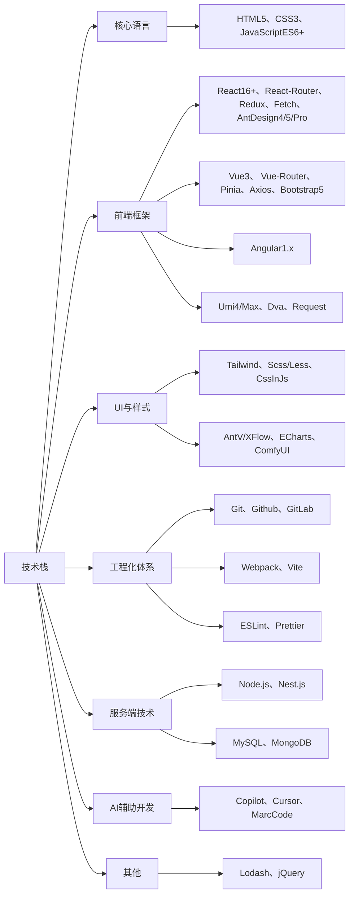

# 👋 你好，我是 DREAM 🐶

I expect that the level of abstraction of our languages will continue to increase. I also expect that the number of domain-specific languages will continue to grow. This will be a good thing. ---《Clean Code》

> 我期望语言的抽象程度继续提升。我也期望领域特定语言的数量继续增加。那会是好事一桩。 ---《代码整洁之道》

## 🚀 关于我 👩‍💻

But it will not eliminate code. Indeed, all the specifications written in these higher level and domain-specific language will be code! It will still need to be rigorous, accurate, and so formal and detailed that a machine can understand and execute it. ---《Clean Code》

> 但那终结不了代码。实际上，**在较高层次上用领域特定语言撰写的规约也将是代码**！它也得严谨、精确、规范和详细，好**让机器理解和执行**。 ---《代码整洁之道》

## 🛠️ 技术栈 ⚛️

